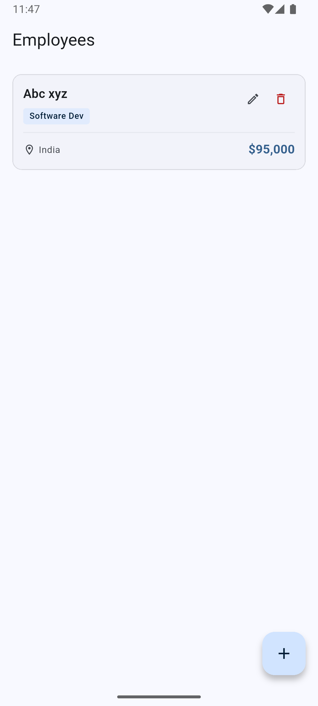
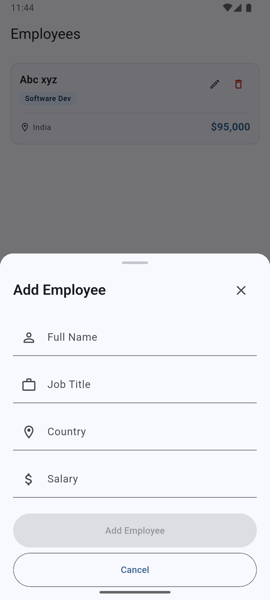
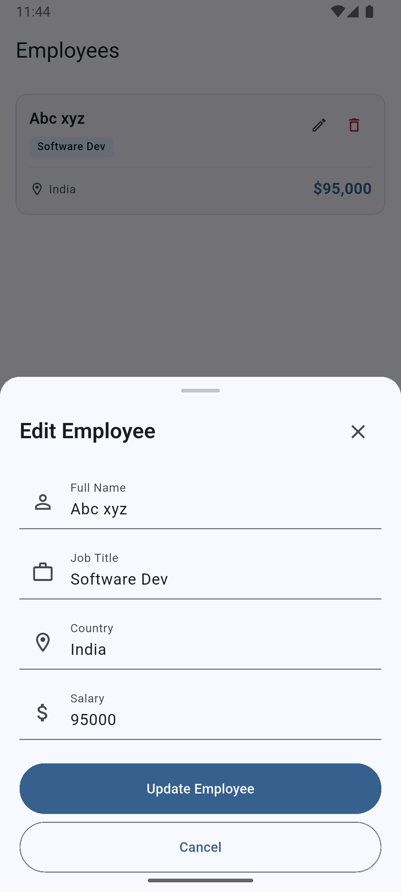
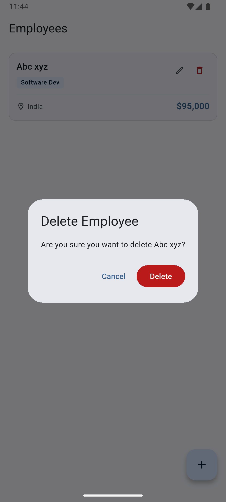

# Employee Salary Management

A Flutter application for managing employee information with salary tracking. The app provides a clean interface for creating, viewing, updating, and deleting employee records with persistent storage using SQLite.

## Overview

This application allows users to manage employee data including full name, job title, country, and salary. All data is persisted locally using SQLite, ensuring data availability across app sessions. The UI is built with Material 3 for a modern, clean interface.

## Features

- **Employee CRUD Operations**: Create, read, update, and delete employee records
- **SQLite Persistence**: All employee data is stored locally in a SQLite database
- **Material 3 UI**: Modern, clean interface following Material Design 3 guidelines
- **Form Validation**: Input validation with clear error messages
- **Delete Confirmation**: Safety dialog before deleting employees
- **Loading States**: Visual feedback during data operations

## Architecture

The application follows a layered architecture with clear separation of concerns:

### Presentation Layer
- **UI Widgets**: `EmployeeListPage`, `EmployeeCard`, `EmployeeFormBottomSheet`
- **State Management**: `EmployeeCubit` using flutter_bloc for reactive state updates

### Business Logic Layer
- **EmployeeCubit**: Manages employee state and coordinates with repository
- Handles async operations and state updates

### Data Layer
- **EmployeeRepository**: Abstracts data access operations
- **DatabaseService**: Manages SQLite database connection and schema
- **Employee Model**: Data model with serialization support

### Development Approach

Development started with UI scaffolding and user interactions. Once the interface and flow were established, data persistence was layered underneath. This approach ensured the user experience was prioritized while maintaining clean architecture.

## Testing

The project follows Test Driven Development (TDD) principles:

### Test Coverage

- **Employee Model**: Unit tests for serialization (`toMap`, `fromMap`) and data validation
- **Database Service**: Tests for database initialization, table creation, and schema validation
- **Employee Repository**: Integration tests for CRUD operations using a test database

### TDD Process

Tests were written first (red phase), then implementation code was added to make tests pass (green phase), followed by refactoring for clarity (refactor phase). This ensures all business logic is covered by tests and the codebase remains maintainable.

Run tests with:
```bash
flutter test
```

## UI Design

The UI is optimized for phones with:

- **ListView Layout**: Single-column list of employee cards
- **Keyboard Handling**: Bottom sheets adjust for on-screen keyboard
- **Material 3 Components**: Cards, buttons, and form fields following Material Design guidelines

## How to Run

### Prerequisites

- Flutter SDK 3.10.7 or higher
- Dart SDK (included with Flutter)

### Installation

1. Clone the repository
2. Install dependencies:
   ```bash
   flutter pub get
   ```

### Running the App

```bash
flutter run
```

### Running Tests

```bash
# Run all tests
flutter test

# Run specific test file
flutter test test/models/employee_test.dart
flutter test test/services/database_service_test.dart
flutter test test/repositories/employee_repository_test.dart
```

## Project Structure

```
lib/
├── cubit/
│   └── employee_cubit.dart          # State management
├── models/
│   └── employee.dart                # Employee data model
├── repositories/
│   └── employee_repository.dart     # Data access layer
├── services/
│   └── database_service.dart        # SQLite database service
├── employee_card.dart               # Employee card widget
├── employee_form_bottom_sheet.dart  # Add/Edit form
├── employee_list_page.dart          # Main list screen
└── main.dart                        # App entry point

test/
├── models/
│   └── employee_test.dart
├── repositories/
│   └── employee_repository_test.dart
└── services/
    └── database_service_test.dart
```

## Dependencies

- **flutter_bloc**: State management using Cubit pattern
- **sqflite**: SQLite database for local persistence
- **sqflite_common_ffi**: SQLite support for testing

## Screenshots

- Employee list view


- Add employee form


- Edit employee form


- Delete confirmation dialog
